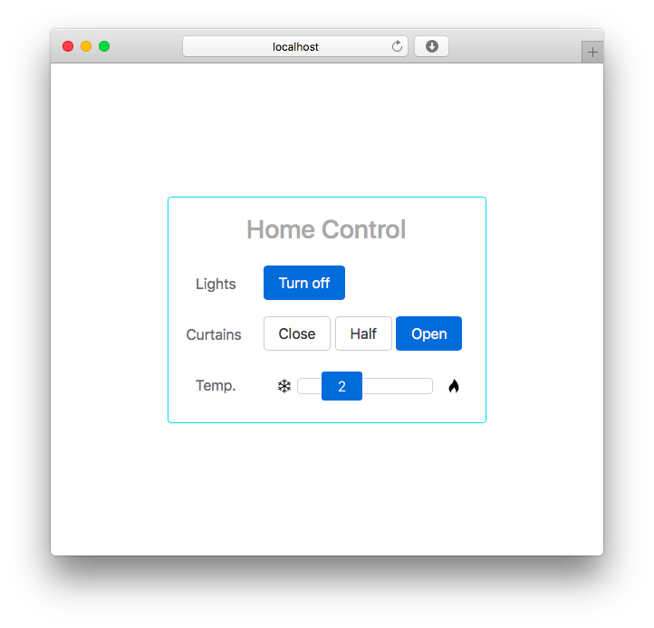
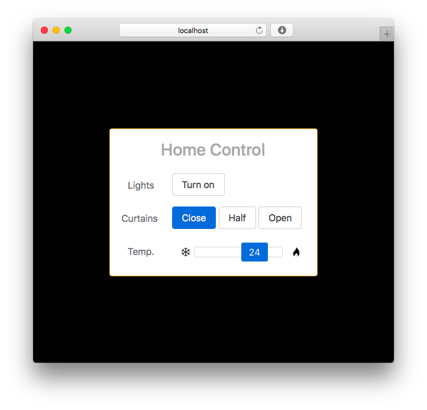
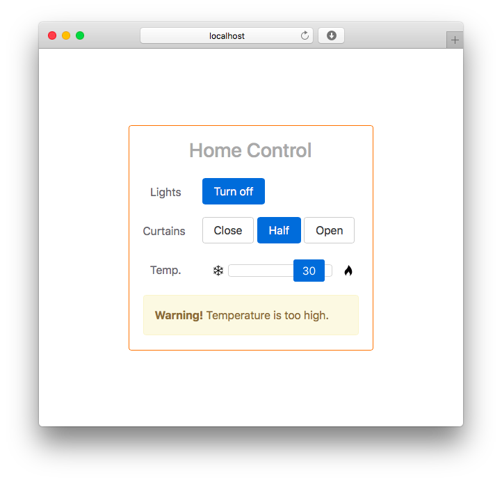

# house-control-panel

Home control for lights, curtains, and temperature.

## Features
* Page background changes based on lights status (black / white)
* Card border color changes based on temperature (blue - red)
* Warning if temperature is too low or too high
* Animations

## Technologies
* Backend: **Spring 4**
* Templating language: **Thymeleaf**
* Frontend layout: **Bootstrap 4**
* DOM Manipulation: **jQuery 3**

## Setup

In project root (`WebServerHomework`).

Installation: `mvn clean install`.

Start the server: `java -jar target/webserver-homework-<ver>.jar` and access at `localhost:8080`.